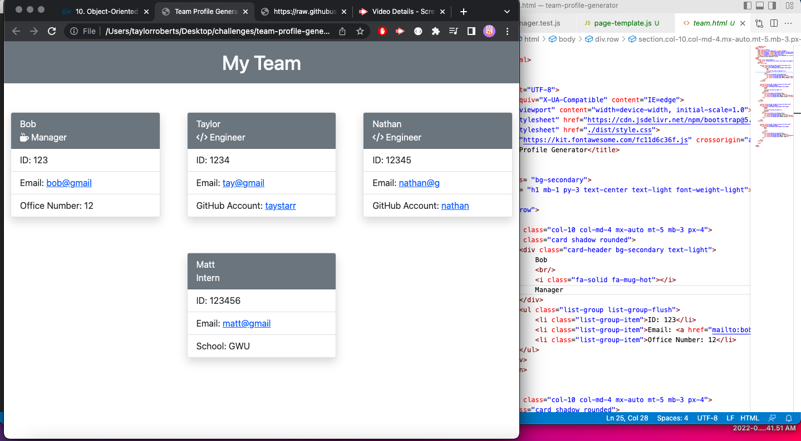

# Team Profile Generator

## Description

This project allows the user to build a team profile from the command line using inquirer. The team members consist of managers, engineers, and interns that can be added. Once all of the prompts are answered the page is built based on the given answers and displays the team members on organized cards.

## Installation

For this project you will have to clone this code to your system and ensure that you have node.js installed and run the npm install command on comand line.

## Usage 

Open code and run 'node index' from command line, answer the prompts and once the program has run check the dist/ folder for the newly created html page with the newly created team profile.

## Tests

Tests for this project were run using jest to ensure the program would run smoothly without bugs.

## Demo

Please click [here](https://drive.google.com/file/d/1rbY3D6Lzbzj8xdGrfVroVCE7OeDLzDpp/view) to watch a demo of this project.

